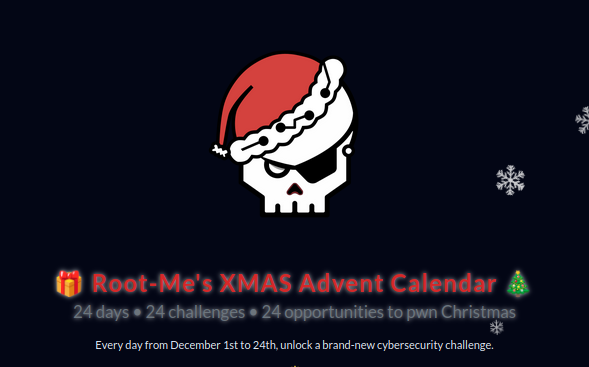
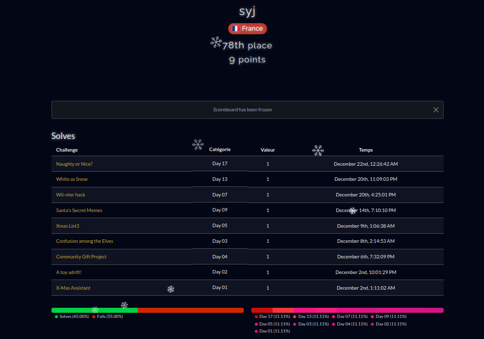

# Writeups of https://ctf.xmas.root-me.org/

For the first time this year, I took on the challenges of the advent calendar organized by RootMe. 
It's a solo CTF (Capture the flag). 

I'm beginner in CTF world. It was tough. I usually clean up "Advent of Code" every year, but I find it too easy now because the exercises are all the same from one year to the next. For Rootme's CTF, I only managed to complete 9 challenges with a lot of effort. I'll do better next year 😀

In this repo, you'll find the write-ups of the few interesting challenges I managed to complete.

# Day 7
[Wii-nter hack - Medium, pwn, crypto ](day7/README.md)

# Day 13
[White as Snow](day13/README.md)

# Day 17
[Naughty or Nice](day17/README.md)

# Scoring 

