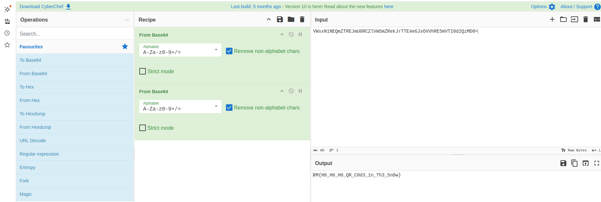

# White as Snow  (  Easy prog  )

# Introduction
This challenge involves opening a 100,000x100,000 24-bit image to find the flag hidden within all the white space.


---

# Overview
There are two main challenges:
- The image saturates memory when opened on a standard computer. I didn’t have a PC with 32GB of free RAM to test opening it fully. Using `tiffinfo`, we can see that the image consists of 11 sub-images at different resolution levels, enabling progressive display.

When I made a mistake and loaded the entire image into memory, I had to force a reboot of my machine. That's why I recommend using `runDocker.sh`, which launches a controlled and memory-limited container.

- Locating the flag within 10^10 pixels. 

---

# Solution

1. The TIFF image is saved in tiles, so the goal was to find a library capable of handling this format.

2. Code the search to identify non-white pixels in the vast white space.

We extract the TIFF image by resolution layers:

```bash
tiffsplit ho_ho_snooow.tiff
```

This generates 11 images in the current directory:
- `xaaa.tif` (100k x 100k)
- ...
- `xaac.tiff` (25,000 x 25,000, the largest image openable in GIMP)
- ...
- `xaak.tiff` (97 x 97)

To avoid an excessively long scan, we first scan `xaac.tif` (25k x 25k resolution) using `libtiff` and save the segmented data in the `work` directory. The scan stops when it finds an image clip containing pixels other than `0xffffff`.

```bash
buildAndRunPart1.sh
```

This extracts data at the coordinates passed as parameters:

```bash
buildAndRunPart2.sh
```

We obtain the final image:


The QR code is actually double Base64-encoded text, which can be decoded using CyberChef:



The final flag is RM{H0_H0_H0_QR_C0d3_1n_Th3_Sn0w}