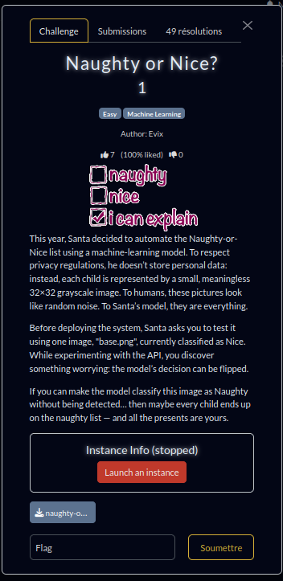

# Naughty or Nice? 

# Introduction


# Overview
The goal of the challenge is to exploit an API that checks whether an image is "naughty" or "nice."

## Endpoints:

Endpoints:

  GET /             -> health check: {"ok": true, "msg": "naughty-or-nice online"}
  GET /info         -> epsilon, levels, width, height, classes, base_sha256

  POST /predict [an image (PNG, grayscale, 32x32)]
    returns: {"label": "Nice|Naughty", "confidence": 0.xx}

  POST /submit [an image (PNG, grayscale, 32x32)]
    checks:
      * L_inf(base, adv) <= 0.03137255 (+ tolerance)
      * label flips after defenses (bit-depth 128)
    returns: flag on success

# Solution
After unsuccessfully attempting to manually manipulate the images, I wondered about the purpose and usage of **POST /predict**.

The algorithm is as follows:

```python
imageBase = Read base.png
worst = boolean[32][32]

For y = 0 to 31:
    For x = 0 to 31:
        newImage = Copy imageBase
        Invert the color of newImage[y][x]
        prediction = Submit newImage to POST /predict
        worst[y][x] = (prediction.label == "naughty") OR (prediction.confidence < 0.53)

worstImage = Copy imageBase
For y = 0 to 31:
    For x = 0 to 31:
        If worst[y][x]:
            If worstImage[y][x] == 0x00:
                worstImage[y][x] = 0x00 + 7
            Else:
                worstImage[y][x] = 0xff - 7

flag = Submit worstImage to POST /submit
print(flag)
```

See the Python implementation: [play.py](play.py)

Run it with:

```bash
python3 play.py
```

```
0, 0 => {'label': 'Nice', 'confidence': 0.537142276763916}
1, 0 => {'label': 'Nice', 'confidence': 0.5338670015335083}
2, 0 => {'label': 'Nice', 'confidence': 0.5384647250175476}
3, 0 => {'label': 'Nice', 'confidence': 0.5478510856628418}
4, 0 => {'label': 'Nice', 'confidence': 0.5184493660926819}
5, 0 => {'label': 'Nice', 'confidence': 0.5449824929237366}
6, 0 => {'label': 'Nice', 'confidence': 0.5234524607658386}
...
21, 31 => {'label': 'Nice', 'confidence': 0.5462828278541565}
22, 31 => {'label': 'Nice', 'confidence': 0.5296788215637207}
23, 31 => {'label': 'Nice', 'confidence': 0.5456055402755737}
24, 31 => {'label': 'Nice', 'confidence': 0.5321204662322998}
25, 31 => {'label': 'Nice', 'confidence': 0.5383446216583252}
26, 31 => {'label': 'Nice', 'confidence': 0.5448790192604065}
27, 31 => {'label': 'Nice', 'confidence': 0.5235676765441895}
28, 31 => {'label': 'Nice', 'confidence': 0.5423343181610107}
29, 31 => {'label': 'Nice', 'confidence': 0.5206905007362366}
30, 31 => {'label': 'Nice', 'confidence': 0.5265871286392212}
31, 31 => {'label': 'Nice', 'confidence': 0.5325164198875427}
Image avec bruit sauvegardée !
Submission: {'label': 'Naughty', 'confidence': 0.5033424496650696}
Submission: {'ok': True, 'flag': 'RM{y0u_4r3_th3_n4ughty_0ne}', 'linf': 0.027450980618596077, 'from': 'Nice', 'to': 'Naughty'}
```

We get the flag RM{y0u_4r3_th3_n4ughty_0ne}