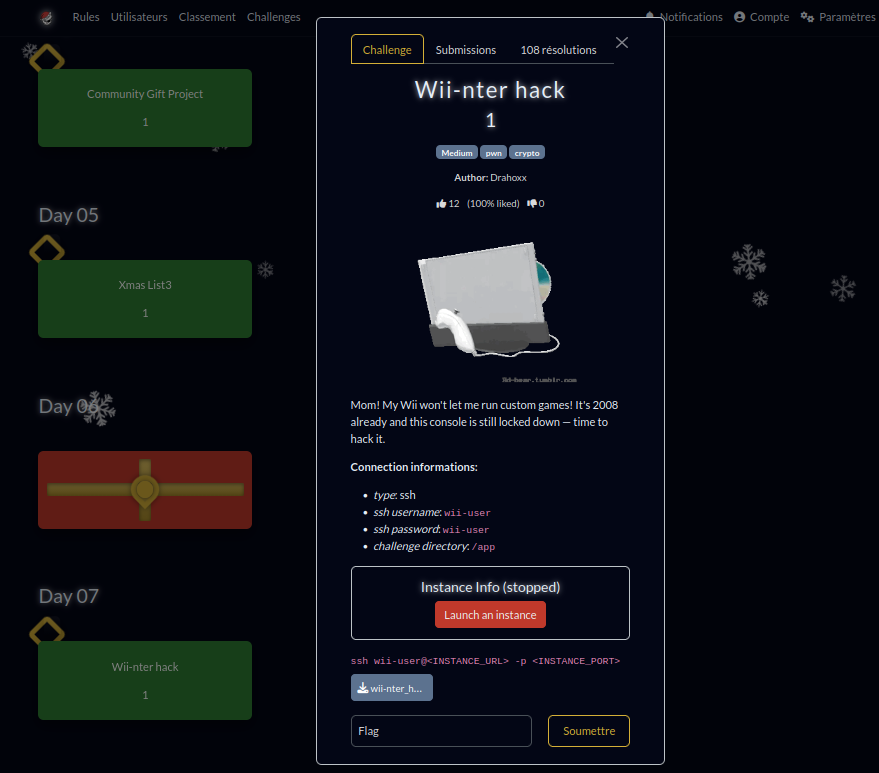

# Wii-nter hack tag: Medium, pwn, crypto

# Introduction
This challenge simulates the hack that was used to break the security of the Wii, allowing users to load any program they want.



# Overview
The challenge is presented as an SSH-accessible server. You connect as the user wii-user.

```
└─[$] find $PWD -name "*"                                            [11:12:49]
/app
/app/launcher
/app/games
/app/games/mika_kart_wii
/app/games/super_smash_bros-brawl_rootme_arena
/app/games/the_legend_of_nikost-twilight_princess
/app/flag.txt
```

```
└─[$] ls -l                                                          [11:12:53]
total 28
-r--r----- 1 wii-admin wii-admin    44 Dec  6 23:22 flag.txt
drwxr-xr-x 1 wii-user  wii-user   4096 Dec  7 21:29 games
-rwsr-xr-x 1 wii-admin wii-admin 17944 Dec  7 21:29 launcher
```

# Objective

The goal is to exploit the launcher, which is responsible for copying and executing one of the three programs in the games directory.

# Analyse

When you decompile the launcher using [dogbolt](https://dogbolt.org/) or [Ghidra](https://ghidra-sre.org/)]. 

You obtain launcher.c.
[launcher.c](launcher.c)

Analyzing the source code reveals that the launcher takes the path to an executable as a parameter. In summary:

1. It reads the binary and identifies two parts. It isolates the last 256 bytes, which contain a SHA-256 hash signed with a private RSA key.

```
 _____________________
| Original game binary|
|_____________________|
|   Signed SHA-256    |
|_____________________|
```


2. Computes the SHA-256 hash of the game binary.
3. Decrypts the signed hash.
4. Compares the signed hash to the computed hash.
5. If they match, it copies the game and executes it.

I initially attempted—without success—to identify:
- Whether the use of RSA was correct 
- Whether it was possible to substitute the executable during the copy process.

After some, I found this articles discussing this attack:
[How Tweezers Defeat Nintendo Wii Security](https://www.xda-developers.com/how-tweezers-defeat-nintendo-wii-security/)

The historical weakness of this system was revealed: it relied on `strncmp`, which stops comparing at the first null byte (`\0`) encountered.

When examining the game images, only the signature for **"super_smash_bros-brawl_rootme_arena"** starts with a `0`:

```bash
dd if=games/super_smash_bros-brawl_rootme_arena bs=1 count=$(( $(stat -c%s games/super_smash_bros-brawl_rootme_arena) - 256 )) | sha256sum
```


# Building the Payload

The base payload is **showflag.c**:

```bash
gcc showflag.c -o showflag
```

It is processed by **craft_game.py**, which generates **showflag_signed**.

Essentially, the script pads the `showflag` binary with a series of numbers until it generates a SHA-256 hash that starts with a zero. Then, it injects the signed hash from **"super_smash_bros-brawl_rootme_arena"**.

The two hashes are not identical, but since `strncmp` stops at the first null byte, they will be considered equal:

```bash
python3 craft_game.py showflag
```

You can simulate the challenge using:

```bash
bash run.sh
```


To copy the payload to the SSH server (since `scp` wasn't working), I used copy/paste with base64 encoding:

```bash
base64 showflag_signed | xclip -i
```

Then, decode it on the server:

```bash
cat | base64 -d > /tmp/showflag_signed
```

Final run, give that: 

```bash

┌─[wii-user@wiinterhack] - [/app] - [92]
└─[$] ./launcher /tmp/showflag_signed                      [13:26:14]
[i] Unciphering signature with public key (m = sig^e mod n).
[i] DECRYPTED HASH:
        00 59 DF 5E D5 96 49 B0 
        F3 88 65 68 F4 0A 8F AF 
        50 FF 4B 37 C9 D1 9C BB 
        2D 84 24 03 5B 27 70 66 


[i]COMPUTED HASH:
        00 00 0A 17 FD 99 C7 44 
        F1 C9 59 3D 49 1F 7D 9B 
        9F CE E0 14 F2 63 EB 2D 
        C8 97 CF B0 FB 76 41 99 


[GOOD] Signature is VALID!
RM{Wii_W4s_S3cUr3_but_N0t_for_Fail0verflow!}%               

```


